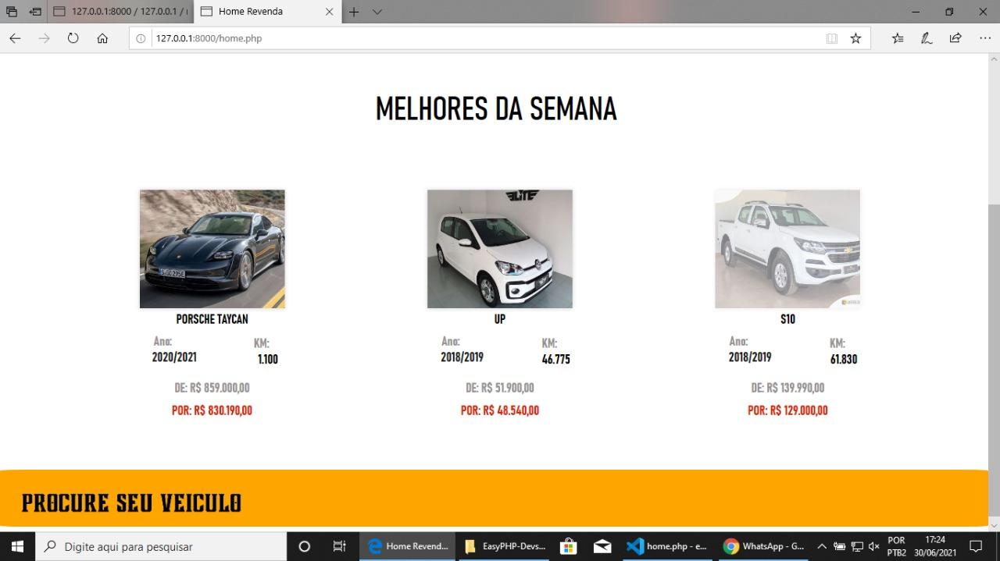
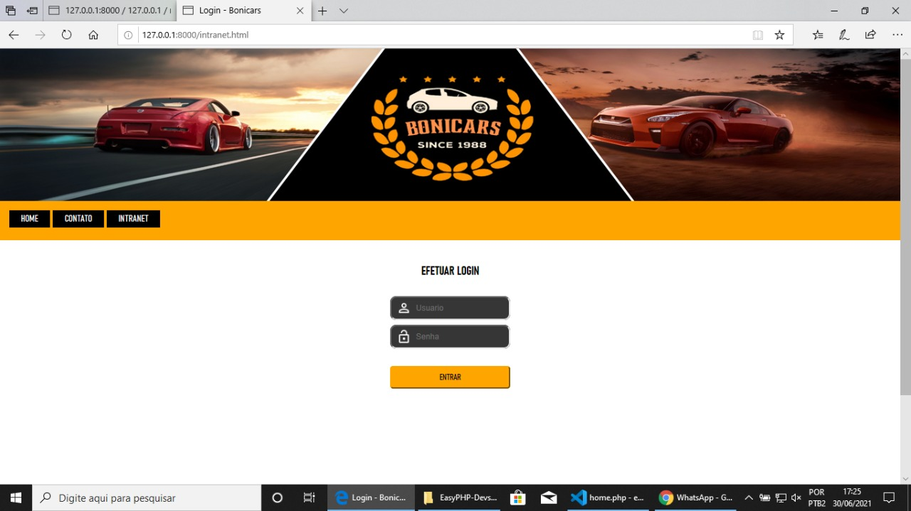
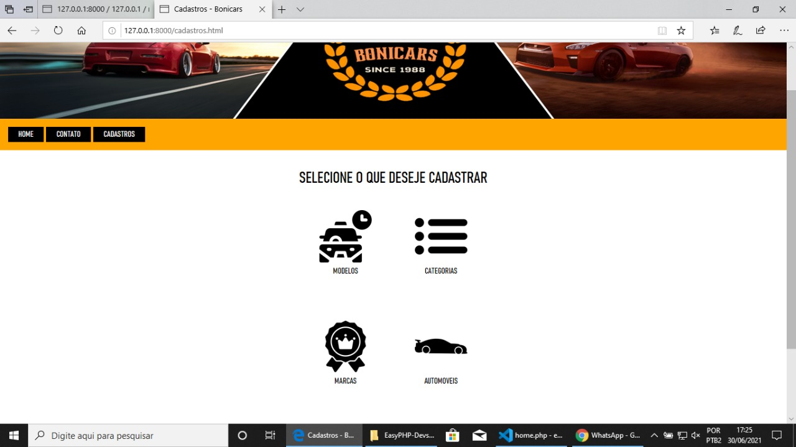
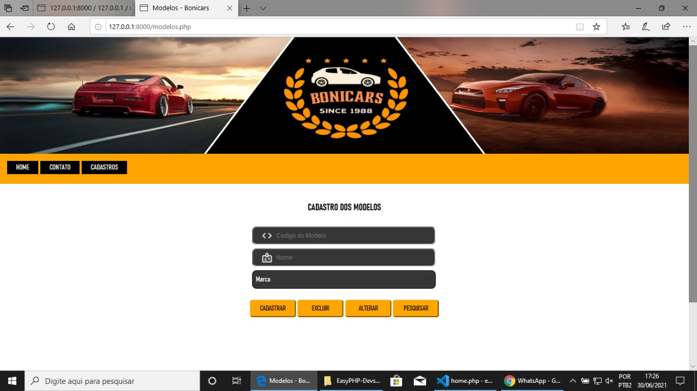
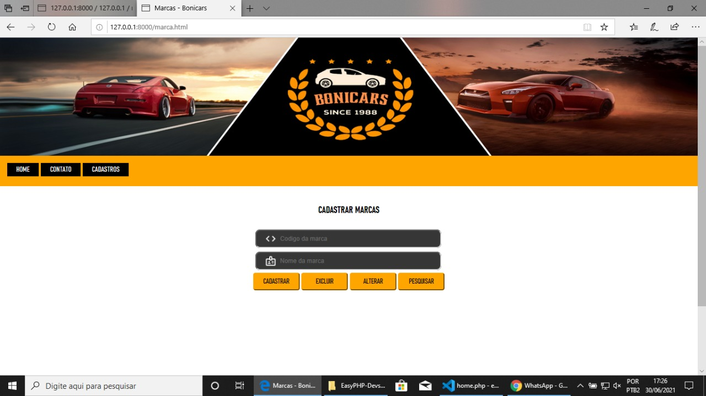
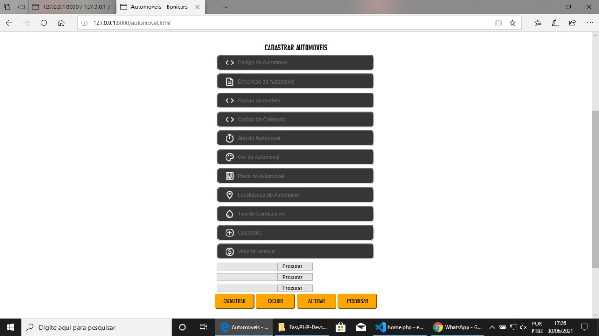
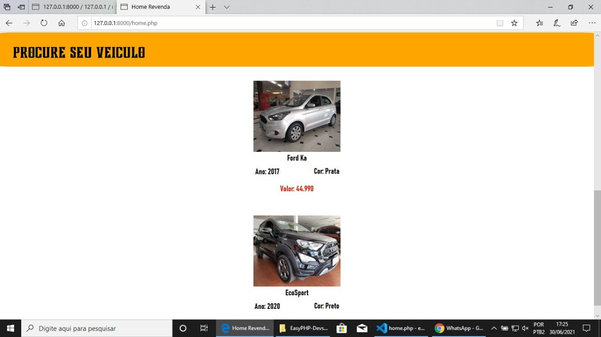

<html><head>

<h2><b>
BONI CARS </b></h3>

<h3><b>
SOBRE O PROJETO </b></h3>
Boni Cars se trata de site de revenda de carros(somente buscas de veículos), desenvolvido na disciplina de desenvolvimento back-end / banco de dados na 3ª fase do curso técnico de informática SATC.

 

<h3><b>
OBJETIVO </b></h3>
O site tem por objetivo fazer a revenda de automóveis, onde o vendedor pode cadastrar carros por categoria, marca, modelo e o próprio veículo através da página INTRANET. Na home está presente alguns veículos de melhores da semana, podendo ser feita a pesquisa do veículo desejado pelo cliente através de SELECTS na aba superior, buscando marca, modelo e categoria. A página contato está indisponível, seria utilizada caso o trabalho fosse mais adiante. O projeto é basicamente uma busca no site, então não tem como ver detalhes a fundo do automóvel, nem mesmo conseguir adquirí-lo ou algo sim, apenas buscar e mostrar o resultado na tela. 

 
 

<h3><b>
HOME </b></h3>
A home é onde o cliente irá encontrar seu veículo, pesquisando por modelo, marca e categoria, ou através dos melhores da semana. 

  

<h3><b>
INTRANET </b></h3>
A intranet é onde o vendedor irá fazer seu login, para então liberar a página de cadastro dos veículos.

  
<h3><b>
CADASTROS </b></h3>
Após logar na página de INTRANET, será redirecionado para a página de cadastros, que possui  4 opções para cadastrar, sendo elas a marca, o modelo, a categoria e o automóvel.

  

<h3><b>
MODELOS </b></h3>
Cadastrar o modelo do veículo. Exemplo (Corsa, Gol, Celta, Astra).

  

<h3><b>
MARCAS </b></h3>
Cadastrar uma marca. Exemplo (Ford, FIAT, Porsche).

  
<h3><b>
CATEGORIAS </b></h3>
Cadastrar a categoria. Exemplo (Sedan, SUV, Picape).

  
<h3><b>
AUTOMÓVEL </b></h3>
Cadastrar os detalhes do automóvel. Exemplo (Cor, Marca, Valor).

  
<h3><b>
PESQUISA </b></h3>
Pesquisa do veículo. Na imagem a pesquisa foi feita por veículos da marca Ford, então os automóveis cadastrados da Ford serão exibidos.

  

<h3><b>
FERRAMENTAS
</b></h3>
O projeto foi desenvolvido em algumas linguagens(HTML, CSS, PHP), utilizando Visual Studio Code como editor de código. Banco de dados utilizado foi MySQL, através da ferramenta phpMyAdmin.

 

  

<h3><b>
DESENVOLVEDOR </b></h3>

 

&#x1F920; Olá, eu sou o Victor. 

 <b>Um pouco mais sobre mim... </b><i>(Aperta aí)</i> 

&#x1F4BB;Cursando Informática no Colégio Satc   
&#x1F4BB;Aluno do 3° ano E.M do Colégio Satc  
&#x1F575;Futuro estagiário  
&#x1F5FA;Cocal do Sul-SC	

&#x1F4F2;Me siga no [instagram](https://www.instagram.com/victor__bonomi/?hl=pt-br)!
 

  

&#x1F4D6;<i>"Nossa tecnologia passou a frente de nosso entendimento, e a nossa inteligência desenvolveu-se mais do que a nossa sabedoria.".  
by: Roger Revelle </i> 

</body></html>